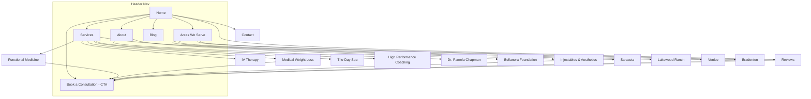

# Site Architecture: The Beauty and Wellness Institute

**Business:** Dr. Pamela Chapman / The Beauty and Wellness Institute
**Location:** 6114 Manatee Ave W, Bradenton, FL 34209 · 941-554-7546
**Site type:** Small business / local medical practice (services + local SEO + booking conversion)
**Primary goal:** Book an appointment (JotForm intake / phone call)
**Depth:** 2 levels (flat, findable, spa-calm) plus a location layer for local SEO

---

## 1. Page Hierarchy (ASCII Tree)

```
Home (/)
├── Services (/services)
│   ├── Functional Medicine (/services/functional-medicine)
│   ├── Medical Weight Loss (/services/medical-weight-loss)
│   ├── IV Therapy (/services/iv-therapy)
│   ├── Injectables & Aesthetics (/services/injectables-aesthetics)
│   ├── The Day Spa (/services/day-spa)
│   └── High Performance Coaching (/services/high-performance-coaching)   [Coming soon]
├── About (/about)
│   ├── Dr. Pamela Chapman (/about/dr-pamela-chapman)
│   └── The Bellanora Foundation (/about/bellanora-foundation)
├── Areas We Serve (/areas-we-serve)
│   ├── Bradenton (/areas-we-serve/bradenton)
│   ├── Sarasota (/areas-we-serve/sarasota)
│   ├── Lakewood Ranch (/areas-we-serve/lakewood-ranch)
│   ├── Venice (/areas-we-serve/venice)
│   ├── Anna Maria Island (/areas-we-serve/anna-maria-island)
│   └── Parrish (/areas-we-serve/parrish)
├── Reviews (/reviews)
├── Blog (/blog)
│   ├── Category: Functional Medicine (/blog/category/functional-medicine)
│   ├── Category: Weight Loss (/blog/category/weight-loss)
│   ├── Category: Aesthetics (/blog/category/aesthetics)
│   └── Category: Wellness & Recovery (/blog/category/wellness-recovery)
├── Book a Consultation (/book)          [Primary conversion, JotForm]
├── Contact (/contact)
└── Legal
    ├── Privacy Policy (/privacy)
    ├── Terms (/terms)
    └── Medical Disclaimer (/medical-disclaimer)
```

**Design note (per brand):** "Areas We Serve" pages carry local SEO ("med spa Bradenton," "functional medicine Bradenton") without cluttering the primary nav. Only 6 priority city pages are built first; the remaining service-area towns from the PMC (North Port, Longboat Key, Palmetto, Ellenton, Holmes Beach, Cortez, Bradenton Beach, Myakka City) are listed on the `/areas-we-serve` hub and added as demand justifies, to avoid thin doorway pages.

---

## 2. Visual Sitemap (Mermaid)



---

## 3. URL Map Table

| Page | URL | Parent | Nav Location | Priority |
|------|-----|--------|-------------|----------|
| Home | `/` | — | Header (logo) | High |
| Services (hub) | `/services` | Home | Header | High |
| Functional Medicine | `/services/functional-medicine` | Services | Header dropdown | High |
| Medical Weight Loss | `/services/medical-weight-loss` | Services | Header dropdown | High |
| IV Therapy | `/services/iv-therapy` | Services | Header dropdown | Medium |
| Injectables & Aesthetics | `/services/injectables-aesthetics` | Services | Header dropdown | High |
| The Day Spa | `/services/day-spa` | Services | Header dropdown | Medium |
| High Performance Coaching | `/services/high-performance-coaching` | Services | Header dropdown | Low |
| About | `/about` | Home | Header | Medium |
| Dr. Pamela Chapman | `/about/dr-pamela-chapman` | About | Header dropdown | High |
| Bellanora Foundation | `/about/bellanora-foundation` | About | Footer | Low |
| Areas We Serve (hub) | `/areas-we-serve` | Home | Header | Medium |
| Bradenton | `/areas-we-serve/bradenton` | Areas We Serve | Footer | High |
| Sarasota | `/areas-we-serve/sarasota` | Areas We Serve | Footer | Medium |
| Lakewood Ranch | `/areas-we-serve/lakewood-ranch` | Areas We Serve | Footer | Medium |
| Reviews | `/reviews` | Home | Header (secondary) | Medium |
| Blog (hub) | `/blog` | Home | Header | Medium |
| Blog category | `/blog/category/{slug}` | Blog | Blog sidebar | Low |
| Blog post | `/blog/{slug}` | Blog | Contextual | Low |
| Book a Consultation | `/book` | Home | Header CTA button | High |
| Contact | `/contact` | Home | Header + Footer | High |
| Privacy | `/privacy` | Home | Footer | Low |
| Terms | `/terms` | Home | Footer | Low |
| Medical Disclaimer | `/medical-disclaimer` | Home | Footer | Low |

---

## 4. Navigation Spec

**Header (7 items max, sticky, 88% ivory + backdrop blur per design system):**
Logo (to Home) · Services (dropdown) · About (dropdown) · Areas We Serve · Reviews · Blog · **[Book a Consultation]** (pill button, sage fill, rightmost)

Tap-to-call phone (941-554-7546) sits as a tracked-caps utility link left of the CTA on desktop, and top of the mobile menu, since phone is a real conversion path for a local practice.

**Services dropdown** lists all six services with a Lucide icon each in the pill-frame motif (`flower-2`, `heart-pulse`, `droplet`, `syringe`, `leaf`, `user-round`).

**Footer (4 columns, sunken greige band):**

| Care | Practice | Areas We Serve | Contact |
|------|----------|----------------|---------|
| Functional Medicine | Dr. Pamela Chapman | Bradenton | 6114 Manatee Ave W, Bradenton, FL 34209 |
| Medical Weight Loss | About TBWI | Sarasota | 941-554-7546 |
| IV Therapy | Reviews | Lakewood Ranch | Book a Consultation |
| Injectables & Aesthetics | Blog | Venice | Newsletter signup |
| The Day Spa | Bellanora Foundation | View all areas | Privacy · Terms · Medical Disclaimer |

**Breadcrumbs** (below header, tracked-caps eyebrow style, teal links) mirror the URL on every L2 page:

- `Home > Services > Functional Medicine`
- `Home > Areas We Serve > Bradenton`
- `Home > Blog > Weight Loss > {Post Title}`

The current page is unlinked ink; ancestors are teal links.

---

## 5. Internal Linking Plan

**Hub-and-spoke:**

- **Services hub** (`/services`) links to all six service pages; each service page links back to the hub and to two sibling services ("Pairs well with"), reflecting the whole-person, connected-care positioning.
- **Areas We Serve hub** links to all city pages; each city page links back up, out to the 3-4 most-searched services, and to `/reviews`.
- **Blog hub** organizes posts into four category pillars; each post links back to its category and to the single most relevant service page (e.g., a semaglutide post links to `/services/medical-weight-loss`).

**Cross-section links (the moat is trust, so route everything toward proof and booking):**

- Every service page includes 2-3 relevant testimonials from `/reviews` and a `/book` CTA.
- `/about/dr-pamela-chapman` links to Services, Reviews, and Book (credibility to action).
- Reviews page filters by service and links each cluster to its service page.
- City pages embed Dr. Chapman credibility + local map, linking to `/about/dr-pamela-chapman`.

**Conversion routing rule:** Every non-legal page carries at least one `/book` and one tap-to-call CTA. Service and city pages carry a sticky mobile "Book" bar.

**Orphan / thin-content guards:**

- No standalone city page ships without unique local copy (service-area intro, map, local testimonials). Empty template pages are not published.
- High Performance Coaching stays a single "coming soon / join the waitlist" page until launch, not a dropdown of sub-pages.

---

## 6. SEO & Local Notes

- **Title/URL targets:** `/services/medical-weight-loss` targets "Medical Weight Loss in Bradenton, FL | GLP-1 & Semaglutide." City pages target "[service] + [city]" intent from the PMC search list.
- **Schema to implement:** `MedicalBusiness` / `MedSpa` on Home + Contact with NAP (6114 Manatee Ave W, 941-554-7546), `Physician` on the Dr. Chapman page, `Review`/`AggregateRating` on `/reviews`, `BreadcrumbList` sitewide, `FAQPage` on service pages.
- **One H1 per page**, sentence case, benefit-led with an italic serif clause per brand voice ("Medical weight loss, *built around you.*").
- **Trailing slash:** none. **Case:** lowercase. **Separator:** hyphens.
- **Compliance:** keep the honest fine print ("Results vary by individual. Consultation required.") on every service page; do not publish specific pricing or GLP-1 specifics until confirmed with the practice.
